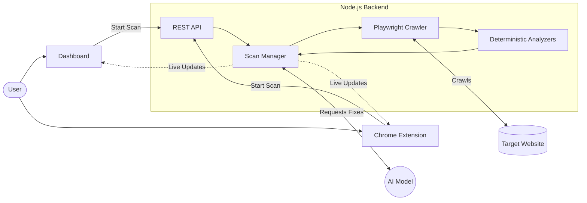

# Trust Issue

Trust Issue is a web security scanner built to test applications for vulnerabilities and tracking scripts. It uses Playwright to crawl pages, runs deterministic checks against the network traffic, and uses an LLM to suggest fixes for the findings.

## How it works

The scanner runs in three steps:

1. **Crawl:** A headless browser (Playwright) maps out the site, finds forms, and triggers network requests.
2. **Analyze:** Custom checkers inspect the network traffic and crawler data for common issues (XSS, missing headers, exposed PII, auth issues, and third-party trackers).
3. **Remediate:** Findings are passed to an LLM to generate context-aware fixes.

## Features

- **Session Sync (Chrome Extension):** If you need to scan authenticated pages, the included Chrome Extension can pass your active session cookies directly to the backend crawler.
- **PII Detection:** Flags API responses that leak credit cards, SSNs, or bulk email addresses.
- **Tracker Detection:** Identifies third-party analytics and tracking scripts.
- **Web Dashboard:** A Next.js frontend that streams scan progress via WebSockets.
- **JSON Export:** Download the raw scan data and AI remediations.

## Architecture



- `/backend`: Node.js engine that handles Playwright, the WebSocket server, and the analysis logic.
- `/src` & `/app`: Next.js 14 frontend dashboard.
- `/extension`: Chrome extension for session management.

## Setup Instructions

### Prerequisites
- Node.js (v18+)
- Chrome / Chromium

### 1. Run the Backend
The backend handles the actual crawling and analysis.
```bash
cd backend
npm install
npm run dev
```

### 2. Run the Frontend
The Next.js app serves the dashboard interface.
```bash
# In the root directory
npm install
npm run dev
```
Open `http://localhost:3000` in your browser.

### 3. Load the Chrome Extension (Optional)
To scan pages that require you to be logged in:
1. Open Chrome and go to `chrome://extensions`.
2. Turn on **Developer mode**.
3. Click **Load unpacked** and select the `/extension` folder.
4. Click the extension icon on any webpage to start a scan using your current session.

## Disclaimer

This tool is for educational purposes and auditing applications you have permission to test. Do not use it against unauthorized targets.
